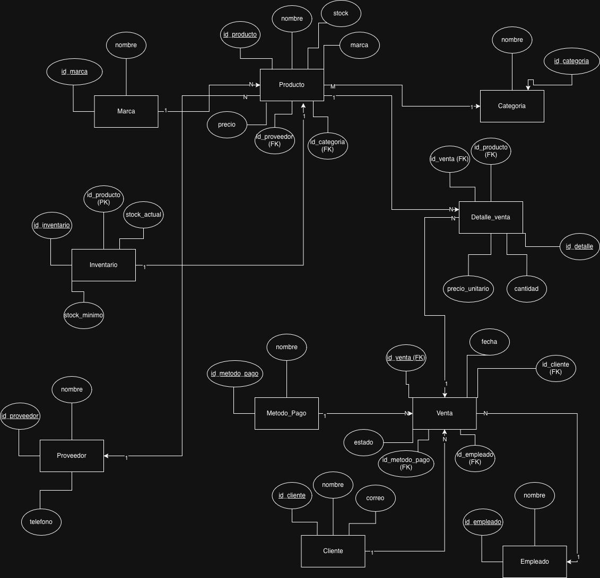
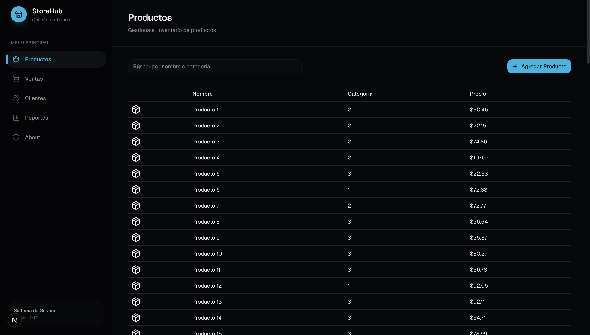

## Setup Instructions

### Prerequisites
*   Docker and Docker Desktop
*   Go (1.21+ recommended)
*   Node.js and pnpm

### Installation

1.  **Environment Configuration**
    Create a `.env` file based on `.env.example`. Per project requirements, use the following credentials for evaluation:
    ```env
    POSTGRES_USER=proy3
    POSTGRES_PASSWORD=secret
    POSTGRES_DB=tienda

    DB_HOST=db
    DB_PORT=5432
    DB_USER=proy3
    DB_PASSWORD=secret
    DB_NAME=tienda
    DB_SSLMODE=disable
    ```

2.  **Launch Database (Docker)**

    This will start the PostgreSQL database container:

    ```bash
    docker compose up
    ```

3.  **Run Backend**
    ```bash
    cd backend
    DB_HOST=localhost DB_PORT=5433 DB_USER=proy3 DB_PASSWORD=secret DB_NAME=tienda DB_SSLMODE=disable go run main.go
    ```

4.  **Run Frontend**
    ```bash
    cd frontend
    pnpm install
    pnpm dev
    ```
    The ports in which everything runs are listed as follows:
    ```md
    ### Ports
    - Backend: http://localhost:8080
    - Frontend: http://localhost:3000
    - Database: localhost:5432

## Usage
Once all services are running, access the application at:
**[http://localhost:3000](http://localhost:3000)**

*   **Inventory:** Navigate to `/productos` to manage stock.
*   **Sales:** Use the cart in `/ventas` to create a new transaction.
*   **Reports:** Visit `/reportes` to view SQL-driven analytics and CTE-based summaries.

---
**Course:** CC3088 Bases de Datos 1
**Institution:** Universidad del Valle de Guatemala

# StoreHub - Inventory and Sales Management System by Alejandro Pérez

## Overview
StoreHub is a professional full-stack web application developed for the **CC3088 Bases de Datos 1** course at **Universidad del Valle de Guatemala**. The system is designed to streamline store operations by managing products, clients, inventory, and sales through a robust relational database and a modern web interface.

The project demonstrates advanced database concepts, including relational schema design, complex SQL querying (CTEs, JOINs, Grouping), and atomic transactions implemented at the backend level.

## Tech Stack
*   **Database:** PostgreSQL
*   **Backend:** Go (Standard Library `net/http`)
*   **Frontend:** Next.js (React), Tailwind CSS, Recharts
*   **Containerization:** Docker & Docker Compose

## Features

### Database & Backend
*   **Relational Integrity:** Complete schema made from scratch (normalization, DDL) with Primary Keys, Foreign Keys, and constraints across entities like `Producto`, `Cliente`, `Venta`, `Detalle_Venta`, and `Inventario`. 
*   **Explicit Transactions:** Sales processing uses explicit `BEGIN / COMMIT / ROLLBACK` logic to ensure data consistency.
*   **Advanced SQL:** Implementation of Common Table Expressions (CTEs), multi-table JOINs, and GROUP BY aggregations for analytics.
*   **REST API:** Clean endpoints for CRUD operations and specialized report generation.
*   **Data Seeding:** Automated scripts generating ~100 realistic records per table using `generate_series`.

API Endpoints

Productos
- GET /productos
- POST /productos
- DELETE /productos/:id

Clientes
- GET /clientes
- POST /clientes

Ventas
- GET /ventas
- POST /ventas

Reportes
- GET /reportes/ventas
- GET /reportes/top-productos
- GET /reportes/cte

### Frontend (Dashboard)
*   **Inventory Management:** Real-time product tracking and CRUD capabilities.
*   **Sales System:** Interactive cart system for processing multi-product sales.
*   **Analytics Reports:** Visual data representation using interactive charts for sales trends and top-performing products.
*   **Modern UX:** Responsive design with dynamic routing and error handling.

## Project Structure
```text
proyecto_2/
├── backend/          # Go API (Business logic & Transactions)
├── frontend/         # Next.js app (Dashboard & UI)
├── db/               # SQL schema, constraints, and seed scripts
├── docker-compose.yml# Infrastructure orchestration
└── README.md         # Project documentation
```

## Dabase Design (DDL)



## Application Preview


